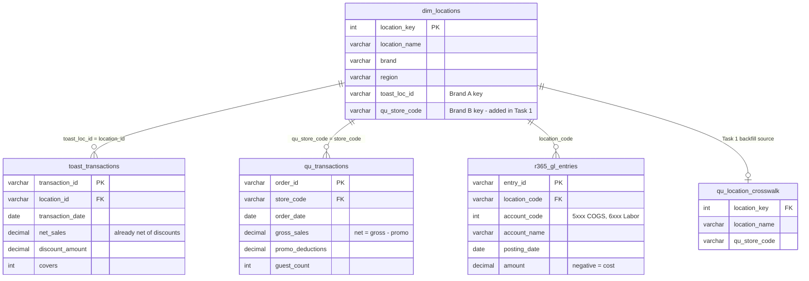

# Harborline Foods - Analytics Engineer III Technical Assessment

A conformed P&L model across three restaurant source systems (Toast POS, Qu POS, Restaurant365) for a fictional multi-brand restaurant group, **Harborline Foods**. Built for the Blue Margin AE III take-home.

## The problem

Harborline runs three brands across 40+ locations on systems that grew up separately and never shared a location key. The consequence: Brand B's sales (in Qu) could not be joined to the rest of the business, so every cross-brand roll-up silently understated revenue. The work conforms the location dimension so each system's store identifier resolves to one location, defines one net-sales figure across the POS systems, and exposes the views the CFO asked for - net sales and COGS by brand, location, and week, plus a filterable Prime Cost view.

> **SQL dialect:** deliverables target **T-SQL** (SQL Server / Microsoft Fabric, Blue Margin's stack), developed and validated in **PostgreSQL** (Postgres.app, run from VS Code). The handful of T-SQL dialect deltas are marked `-- [T-SQL]` inline and applied cleanly in `submission/tsql/`.

## Schema

## Deliverables

| # | File | What it does |
|---|------|------|
| 1 | `sql/01_dimension_fix.sql` | Adds and backfills `qu_store_code` so Brand B joins to its sales. |
| 2 | `sql/02_conformed_net_sales.sql` | Conforms net sales across Toast + Qu, with validation checks. |
| 3 | `dax/measures.md` | Power BI DAX measures: Current Week, Rolling 4-Week Avg, Prime Cost %. |
| 4 | _(in the submission package)_ | Stakeholder note to the CFO - delivered with the emailed submission, not committed here. |

Clean T-SQL submission copies are in `submission/tsql/`. The SQL was validated in PostgreSQL from VS Code, with before/after and validation checks built into `sql/02_conformed_net_sales.sql`. Tools, time, assumptions, and the AI-usage log are in `submission/header_note.md`.
